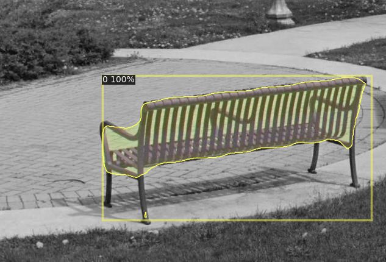

# Toward Complete Automated Walkability Audits with Street View Images: Leveraging Virtual Reality for Enhanced Semantic Segmentation

This repository contains code and resources for our study on automated walkability audits using street view images. We leverage virtual reality for enhanced semantic segmentation, improving urban walkability assessments.

## Dataset
The dataset is available upon request. Please fill out the following form: [Google Forms link].

### Sample Data
- **Training Sample:**  
  
- **Testing Sample:**  
  

## Requirements
To run this project, you need the following dependencies:

- **Detectron2** by Meta (Installation guide: [Detectron2 Documentation](https://detectron2.readthedocs.io/en/latest/tutorials/install.html))
- **Recommended installation:** Docker
- **For Windows users:** Refer to [this guide](https://helloshreyas.com/how-to-install-detectron2-on-windows-machine) for installation steps.

## Benchmark
We use **ADE20K** as our benchmark dataset. More details can be found here: [ADE20K Dataset](https://ade20k.csail.mit.edu/).

## Inference
To run inference using our model, follow these steps:

1. Download the pre-trained model from [Google Drive link](https://drive.google.com/drive/folders/1JNZF2dOIcHk8bFP6hn2DFpXZ0Sld2dCK?usp=drive_link).
2. Use the provided `inference.ipynb` notebook.
3. Alternatively, run the following code snippet:

```python
from PIL import Image
import cv2
import numpy as np

from detectron2.utils.visualizer import ColorMode, Visualizer
from detectron2 import model_zoo
from detectron2.engine import DefaultPredictor
from detectron2.config import get_cfg
from detectron2.utils.visualizer import Visualizer
from detectron2.data import MetadataCatalog, DatasetCatalog
import torch

# Configure model
cfg = get_cfg()
cfg.INPUT.MASK_FORMAT = 'bitmask'
cfg.merge_from_file(model_zoo.get_config_file("COCO-InstanceSegmentation/mask_rcnn_R_50_FPN_3x.yaml"))
cfg.MODEL.ROI_HEADS.NUM_CLASSES = 1
cfg.MODEL.WEIGHTS = "best_model_bench.pth"
cfg.MODEL.ROI_HEADS.SCORE_THRESH_TEST = 0.7
predictor = DefaultPredictor(cfg)

# Load and process image
im = cv2.imread("61_jpg.rf.4e147b7acbea1a7ded08a22b42d1f0ec.jpg")
outputs = predictor(im)

# Visualize predictions
v = Visualizer(im[:, :, ::-1], scale=1, instance_mode=ColorMode.IMAGE_BW)
out = v.draw_instance_predictions(outputs["instances"].to("cpu"))
display(Image.fromarray(out.get_image()[:, :, ::-1]))
```

